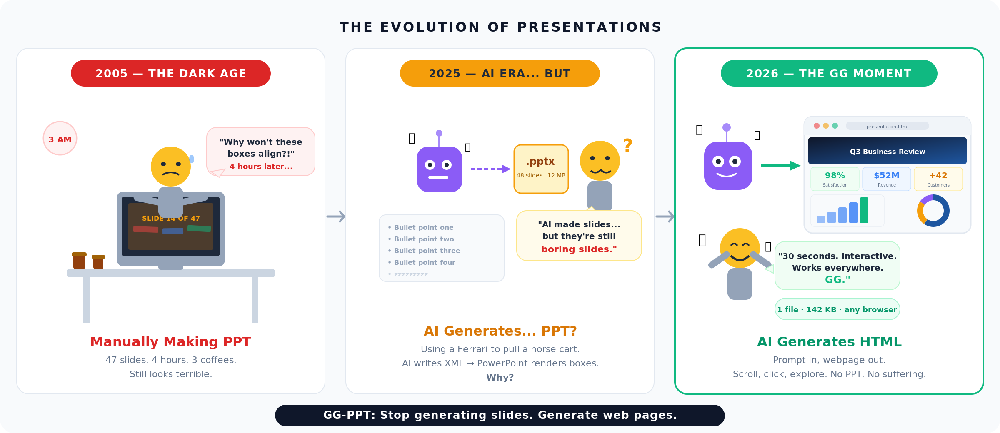
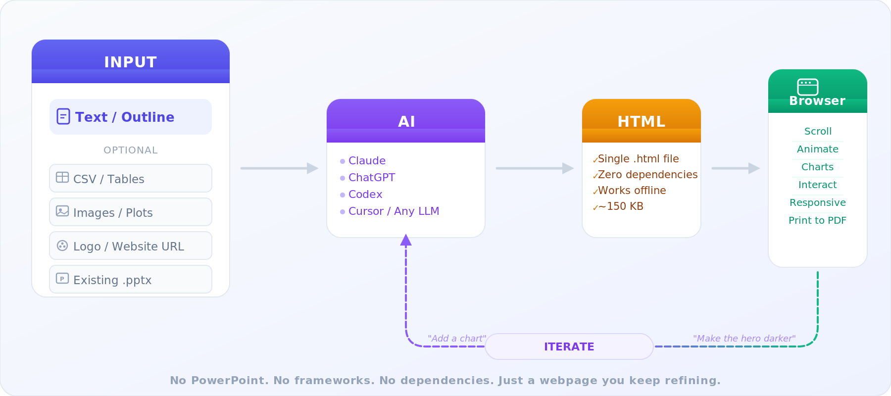

<h1 align="center">GG-PPT</h1>

<p align="center">

[](https://opensource.org/licenses/MIT)
[](https://github.com/dgtql/gg-ppt)
[](https://github.com/dgtql/gg-ppt)
[](https://github.com/dgtql/gg-ppt)
[](https://github.com/dgtql/gg-ppt)
[](https://claude.ai)
[](https://chat.openai.com)
[](https://openai.com/codex)
[](https://cursor.sh)

</p>

<p align="center"><strong>GG, PowerPoint.</strong></p>

<p align="center">
  <a href="../README.md">English</a> | <a href="README.zh-CN.md">简体中文</a> | <a href="README.es.md">Español</a> | <a href="README.de.md">Deutsch</a> | <a href="README.fr.md">Français</a> | <strong>Русский</strong>
</p>

<p align="center">
  
</p>

> На дворе 2026 год. У вас есть AI, который пишет код за секунды. А вы всё ещё... перемещаете текстовые поля по слайдам?

---

## Проблема, о которой никто не говорит

Все ненавидят делать PowerPoint. Но мы продолжаем это делать. Почему?

**"Это используют все."** Босс ждёт `.pptx`. Клиент ждёт `.pptx`. Конференция требует `.pptx`. Вы открываете PowerPoint, смотрите на пустой слайд и начинаете перемещать прямоугольники. Опять.

**"Альтернатив нет."** Google Slides? То же самое, другой логотип. Keynote? То же самое, красивее шрифт. Prezi? Давайте не будем об этом.

**"AI теперь может делать слайды за меня."** И вот тут начинается абсурд. Мы создали самую мощную технологию генерации текста в истории человечества... и используем её для создания `.pptx` файлов. Это как ездить на Ferrari для перевозки повозки.

Подумайте, что происходит, когда LLM "генерирует PowerPoint":
1. AI генерирует структурированный контент (текст, заголовки, маркеры)
2. Скрипт преобразует это в XML внутри `.zip` файла (именно это и есть `.pptx`)
3. PowerPoint преобразует XML в прямоугольники на холсте фиксированного размера
4. Вы открываете это, прищуриваетесь и начинаете вручную исправлять выравнивание

**Почему мы конвертируем вывод AI в файловый формат 1987 года, чтобы отобразить его в проприетарном приложении?**

## Очевидный ответ

AI генерирует текст. Браузеры красиво отображают текст. Пропустите посредника.

<p align="center">
  
</p>

Вот и всё. Никаких `.pptx`. Никакого XML. Никакого PowerPoint. Никаких лицензионных сборов. Просто веб-страница.

**gg-ppt** — это набор подсказок + система дизайна, которую может использовать любой AI для генерации красивых интерактивных HTML-презентаций. Работает с **Claude**, **ChatGPT**, **Codex**, **Cursor**, **Copilot** или любым LLM, который может писать код. Один запрос, один файл `.html`. Откройте в любом браузере, на любом устройстве, онлайн или оффлайн.

### Что на самом деле означает "HTML-презентация"

Не слайды. Не прямоугольники на холсте. **Текущая интерактивная веб-страница** — как полированная страница продукта, по которой вы прокручиваете. Каждый раздел заполняет область просмотра, анимация запускается при прокрутке, графики интерактивны, и всё это кажется живым.

Ваша аудитория не нажимает "Следующий слайд" 47 раз. Они прокручивают. Кликают на вкладки. Наводятся на графики. Исследуют.

## Посмотрите в действии

Откройте [`assets/example.html`](../assets/example.html) в своём браузере. Это Q3 обзор бизнеса в стиле **stripe.com**, созданный из:

- [`assets/sample-inputs/agenda.md`](../assets/sample-inputs/agenda.md) — текстовый план
- [`assets/sample-inputs/revenue_quarterly.csv`](../assets/sample-inputs/revenue_quarterly.csv) — данные о доходах → автоматически созданные столбчатые графики + таблицы
- [`assets/sample-inputs/customer_segments.csv`](../assets/sample-inputs/customer_segments.csv) — данные о клиентах → кольцевая диаграмма + когорты удержания
- `stripe.com` — URL сайта → цвета бренда, типография, тени и атмосфера автоматически извлечены

Прокрутите это. Кликните на вкладки. Нажмите `N` для заметок докладчика. Нажмите `Ctrl+P` для просмотра печати в PDF.

## Почему PowerPoint всё ещё существует (и почему не должен)

| Почему люди используют PPT | Почему это больше не имеет смысла |
|---|---|
| "Все знают, как его использовать" | Все тоже знают, как открыть браузер |
| "В нашей компании есть шаблоны" | Загрузите логотип или вставьте URL сайта — AI автоматически извлечет цвета бренда, шрифты и стиль |
| "Мне нужны графики и таблицы" | HTML имеет встроенные SVG-графики, интерактивные таблицы, анимированные счётчики — всё лучше, чем SmartArt |
| "Мне нужны заметки докладчика" | Нажмите `N`. Заметки синхронизируются с позицией прокрутки |
| "Мне нужно поделиться это как файл" | Это один файл `.html`. Отправьте по email. Пошлите в Slack. Скопируйте на USB. 142KB |
| "Мне нужна PDF-версия" | `Ctrl+P`. Встроенная таблица стилей печати с автоматическими разрывами страниц |
| "Мне нужна презентация оффлайн" | Нулевые внешние зависимости. Работает с USB-накопителя без интернета |
| "Моя аудитория ожидает слайды" | Ваша аудитория ожидает не скучать. Покажите им что-то интерактивное |

## Что вы можете отправить?

| Ввод | Что происходит |
|------|-----------|
| **Тема или план** | Структурирует в разделы, выбирает макеты, пишет повествование |
| **Заметки встречи или длинный текст** | Выделяет ключевые моменты в визуальную прокручиваемую презентацию |
| **CSV / Excel данные** | Читает данные и генерирует встроенные SVG-графики (столбчатые, линейные, кольцевые, большие цифры) |
| **Изображения или графики** | Встраивает их как base64, чтобы файл оставался самодостаточным |
| **Логотип компании** | Извлекает цвета бренда и автоматически оформляет всю презентацию |
| **Существующий файл .pptx** | Извлекает текст + изображения, переструктурирует в текущую HTML-страницу (не копирует слайд за слайдом) |
| **URL сайта** | "Сделай как stripe.com" — получает CSS сайта, извлекает цвета, шрифты, border-radius, тени и атмосферу, затем оформляет вашу презентацию в соответствии |
| **Любая комбинация** | "Вот палуба с прошлого квартала, обновленные числа в этом CSV и наш новый логотип — оформи как linear.app" |

## Быстрый старт

### Используйте с Claude (Skill)

Скопируйте папку `gg-ppt` в каталог навыков Claude:

```
~/.claude/skills/gg-ppt/
```

Затем просто попросите Claude создать презентацию — skill автоматически запустится.

### Используйте с ChatGPT / Codex / Copilot / Cursor / Любым LLM

Вставьте содержимое [`SKILL.md`](../SKILL.md) как контекст (или приложите файл), затем введите:

> "Прочитайте прикрепленный SKILL.md и руководство дизайна. Создайте HTML-презентацию о результатах нашего Q3. Вот логотип нашей компании."

Или проще — просто вставьте [`references/design-guide.md`](../references/design-guide.md) как контекст и скажите:

> "Следуя этой системе дизайна, создайте одностраничную HTML-презентацию о [вашей теме]. Сделайте это как прокручиваемую веб-страницу, а не слайды."

Основная идея работает с **любым LLM, который может генерировать HTML**. SKILL.md и руководство дизайна — это просто детальные инструкции — любой AI может их следовать.

### Используйте отдельно (без AI)

Скрипты работают независимо:

**Извлечение цветов бренда из логотипа:**
```bash
pip install Pillow
python scripts/extract_colors.py your-logo.png --css
```

**Совпадение визуального стиля сайта:**
```bash
pip install requests beautifulsoup4
python scripts/extract_style.py stripe.com --css
```

Оба выводят CSS-пользовательские свойства, которые вы можете вставить в любой HTML-проект.

### Брендовое оформление

Два способа оформить вашу презентацию — оба автоматические:

**Из логотипа** — загрузьте любое изображение, и skill извлечет 6-цветную палитру бренда:

```bash
python scripts/extract_colors.py your-logo.png --json
```

```json
{
  "primary": "#2B5EA7",
  "secondary": "#5A8FCB",
  "accent": "#F4A623",
  "light": "#F0F4F8",
  "dark": "#1A2332",
  "neutral": "#6B7B8D"
}
```

**Из сайта** — задайте URL, и он извлечет весь визуальный язык сайта: цвета, шрифты, border-radius, тени и общую атмосферу:

```bash
python scripts/extract_style.py stripe.com --json
```

```json
{
  "palette": { "primary": "#533afd", "secondary": "#fb76fa", "accent": "#ff6118" },
  "typography": { "heading_font": "sohne-var", "body_font": "SourceCodePro" },
  "shape": { "border_radius": "12px", "shadow_style": "elevated" },
  "vibe": ["colorful"]
}
```

Цвета проникают в каждый элемент — навигационные полосы, заголовки, цвета графиков, состояния наведения, градиенты. "Сделай как Stripe" → просто работает.

### Итерация

Skill поддерживает естественное общение туда-обратно. После первой версии просто говорите:

- *"Сделай герой-секцию более драматичной"*
- *"Измени цвета, чтобы соответствовать этому новому логотипу"*
- *"Оформи как linear.app"*
- *"Добавь раздел временной шкалы между статистикой и сравнением"*
- *"Цифры неправильные — используй 92%, 4.2x и $0"*
- *"Сделай минималистичнее — меньше цвета, больше белого пространства"*

Ваш AI прочитает существующий HTML и выполнит хирургические правки. Разделы, о которых вы не упомянули, останутся неизменными. Это как разговор с дизайнером, который мгновенно реализует ваши отзывы.

## Что вы получаете

Один файл `.html` с:

| Функция | Деталь |
|------|------|
| Анимация при прокрутке | Разделы исчезают при прокрутке — плавно, а не кричаще |
| Брендовое оформление цвета | Автоматически извлечено из логотипов, URL сайтов или палитр, соответствующих теме |
| Соответствие стилю сайта | Задайте URL — извлекает цвета, шрифты, тени, border-radius, атмосферу |
| Интерактивные SVG-графики | Столбчатые, кольцевые, линейные графики — без Chart.js, без D3, без CDN |
| Анимированные счётчики | Большие числа, которые считают при прокрутке в представление |
| Контент с вкладками | Кликните для переключения представлений внутри раздела |
| Таблицы данных | Стилизованные таблицы с цветокодированными изменениями (зелёный = вверх, красный = вниз) |
| Заметки докладчика | Нажмите `N` для переключения, синхронизировано с позицией прокрутки |
| Печать в PDF | Таблица стилей `@media print` с чистыми разрывами страниц |
| Отзывчивый дизайн | Рабочий стол, планшет, телефон — CSS Grid справляется |
| Доступность | `prefers-reduced-motion`, семантический HTML, контраст WCAG AA |
| Итеративное редактирование | Простое языковое редактирование, без полной регенерации |
| Нулевые зависимости | Всё встроено — работает оффлайн с USB-накопителя |

## PowerPoint vs. gg-ppt

| | PowerPoint | gg-ppt |
|---|---|---|
| **Создание** | Вручную перемещайте коробки на слайдах | Опишите простым текстом, AI генерирует |
| **Вывод** | Проприетарный двоичный формат | Один файл `.html` |
| **Интерактивность** | Нажимайте "следующий слайд" | Прокручивайте, кликайте вкладки, наводитесь на графики, исследуйте |
| **Графики** | Статический SmartArt | Анимированный SVG с реальными метками данных |
| **Брендирование** | Примените шаблон, исправьте 47 вещей | Загрузите логотип или вставьте URL — цвета, шрифты, атмосфера автоматически извлечены |
| **Редактирование** | Переоткройте, переменяйте, переэкспортируйте | "Сделай героя темнее" → готово |
| **Обмен** | Требуется установленный PowerPoint/Viewer | Любой браузер, любое устройство, любая ОС |
| **Стоимость** | $159/год (Microsoft 365) | $0 |
| **Размер файла** | 5-50 MB | ~150 KB |
| **Оффлайн** | Да | Да |
| **Мобильная** | Едва | Полностью отзывчивая |

## Почему не Reveal.js / Slidev / и т.д.?

Это хорошие инструменты, но они всё ещё **фреймворки слайдов** — они навязывают ту же модель мышления от слайда к слайду, как PowerPoint. gg-ppt отличается:

- **Без фреймворка** — чистый HTML/CSS/JS, ничего не нужно устанавливать или конфигурировать
- **Не слайды** — это текущая веб-страница, как страница продукта
- **AI-нативный** — разработан для генерации AI текст-в-HTML, а не ручного создания
- **Один файл** — без этапа сборки, без `npm install`, без файлов конфигурации
- **Без кривой обучения** — вы не учитесь gg-ppt, вы просто описываете, что хотите

## Структура файлов

```
gg-ppt/
├── SKILL.md                          # AI инструкции (работает с любым LLM)
├── README.md                         # Английский README
├── README.zh-CN.md                   # Упрощённый китайский README
├── README.ru.md                      # Русский README (вы здесь)
├── LICENSE                           # MIT
├── references/
│   └── design-guide.md               # Полная система дизайна
├── scripts/
│   ├── extract_colors.py             # Логотип → палитра бренда
│   └── extract_style.py              # URL сайта → руководство стиля
└── assets/
    ├── example.html                   # Живая демонстрация (стиль Stripe) — откройте в браузере
    ├── comic.png                      # Баннер комиксов для README
    ├── system-diagram.png             # Диаграмма архитектуры для README
    └── sample-inputs/                 # Входные данные, которые создали демонстрацию
        ├── agenda.md                  # Текстовый план
        ├── revenue_quarterly.csv      # Данные о доходах → графики
        └── customer_segments.csv      # Данные о клиентах → кольцевая + когорты
```

## Ставка

PowerPoint был изобретён в 1987 году, чтобы заменить прозрачные плёнки для диапроекторов. Его основная модель взаимодействия — размещение прямоугольников на слайдах — не изменилась за 39 лет.

В 2026 году у нас есть AI, который генерирует структурированный, стилизованный контент за секунды. Браузер — это самый мощный механизм рендеринга, когда-либо построенный. На каждом устройстве на Земле есть один.

**gg-ppt** — это ставка на то, что презентации должны быть просто веб-страницами. Красивые, интерактивные, фирменные веб-страницы, которые вы описываете простым текстом, а любой AI строит для вас.

GG, PowerPoint. Хорошо сыграно.

## Участие

Обнаружили баг? Есть идея для нового паттерна макета? PR приветствуются.

## Лицензия

MIT
